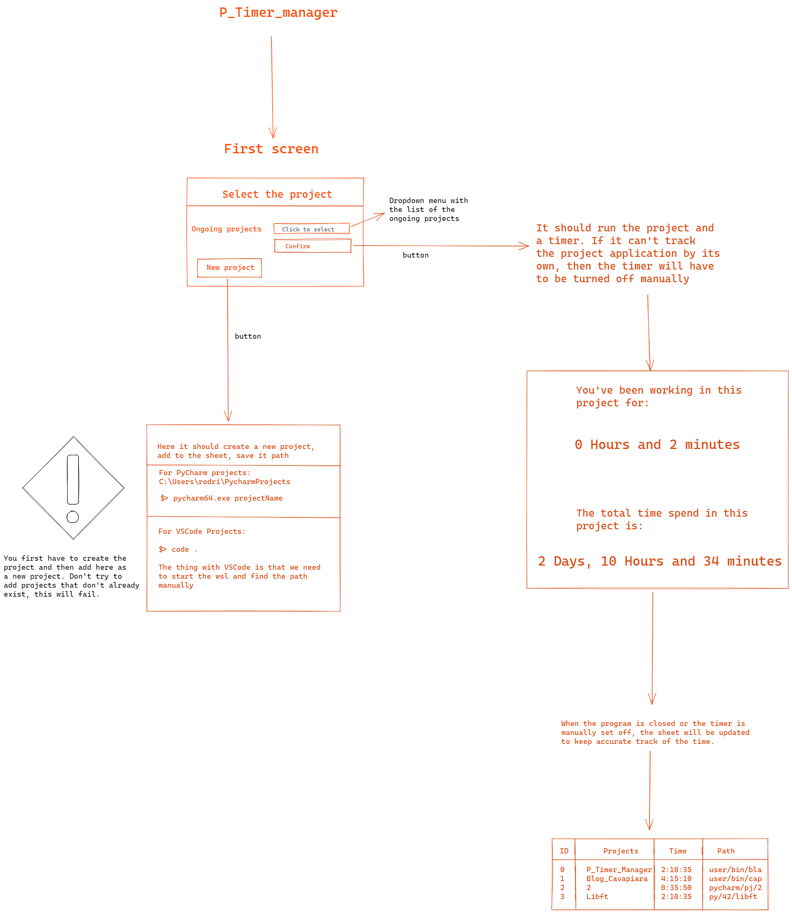

# P_Time_Manager

P_Time_Manager is a project that aims to calculate the time I spend on each project, keeping track of previous projects 
and allowing new ones to be added.

The goal is that when I start the program, I inform which project I intend to work on and the P_Time_manager 
will register the start and end time of my work, updating the spreadsheet and keeping a reliable report of the 
total time I spend on each project.

